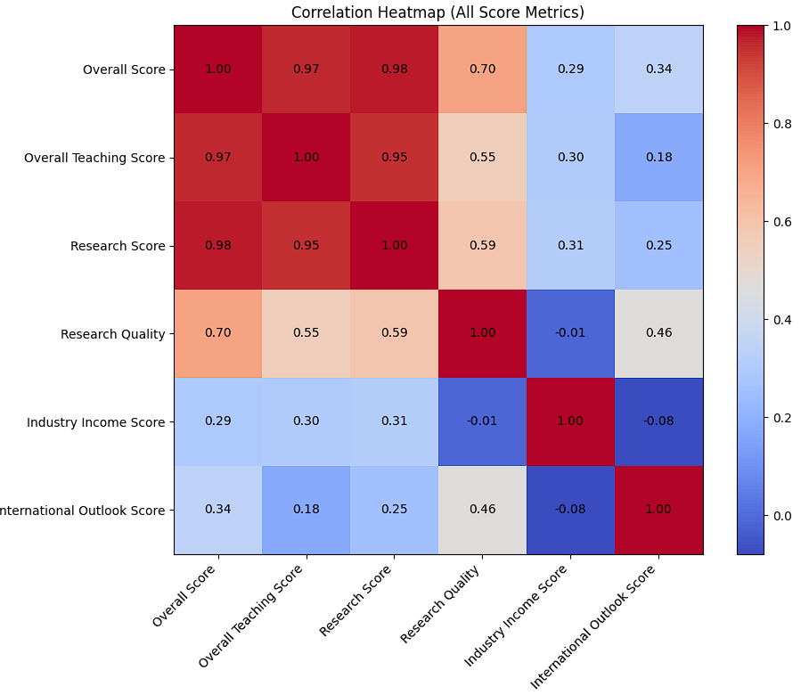
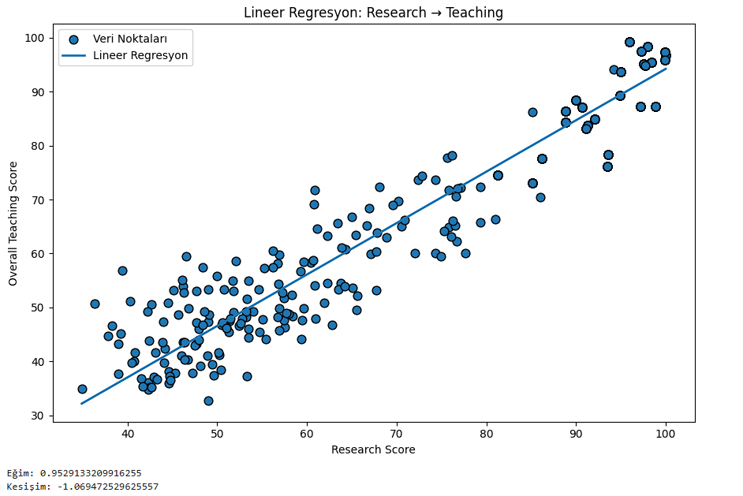

# Dünyadaki Üniversitelerin Veri Analizi 

Bu proje, üniversite performans veri seti üzerinde yapılan analizleri ve görselleştirmeleri içerir.  
Özellikle eğitim ve araştırma skorları arasındaki ilişki, sayısal metrikler arasındaki korelasyon ve ülke bazında Overall Score ortalamaları incelenmektedir.

---

## Proje Amacı

- Üniversite performans verilerini analiz ederek eğitim ve araştırma skorları arasındaki ilişkileri anlamak.  
- Sayısal değişkenler arasındaki korelasyonları belirlemek.  
- Ülkeler bazında ortalama performans farklılıklarını görselleştirmek.  

Proje, veri analizi ve görselleştirme adımlarını birleştirerek üniversite performansına dair içgörüler üretmeyi hedefler.

---

## Veri Seti
- Format: CSV  
- Özellikler:
  - Location → Üniversitenin bulunduğu ülke  
  - Teaching → Öğretim kalitesi skoru  
  - Research Score → Araştırma performans skoru  
  - Overall Score → Genel performans  
  - Diğer sayısal skorlar: Industry Income, International Outlook vb.

---

## Veri İşleme Adımları
1. Pandas, Numpy, Matplotlib gibi gerekli kütüphaneleri projeme dahil ettim.
2. data.csv dosyasını okuyup tablo haline getirdim.
3. Veri Yükleme: CSV dosyası okunmuş ve ilk birkaç satır görüntülenmiştir.  
4. Sütun Seçimi: Teaching ve Research Score sütunları seçilmiş ve sayısala dönüştürülmüştür.  
5. Eksik Veri Temizliği: Analiz için gerekli sütunlarda eksik veriler çıkarılmıştır.  
6. Korelasyon Analizi: Sayısal tüm sütunlar arasındaki Pearson korelasyon katsayıları hesaplanmış ve ısı haritası ile görselleştirilmiştir.  
7. Ülke Bazlı Ortalama: Overall Score değerleri ülke bazında gruplanmış ve ortalama skorlar çizgi grafiği ile görselleştirilmiştir.

---

## Görseller ve Yorumlar

### 1. Sayısal Değişkenler Arasındaki Korelasyon

 
+ Heatmap, sayısal skorlar arasındaki ilişkileri renk ve sayı ile gösteriyor.  
+ Teaching ve Research Score arasında güçlü bir pozitif korelasyon mevcut (r = 0.97).  
+ Research Quality ve Research Score arasında diğerlerine nazaran daha güçsüz bi bağlantı var (r = 0.79). Bu da Research Quality'nin Overall Score'de çok etkisinin olmadığını gösterir. 
+ Analiz, hangi skorların birbirini etkilediğini ve hangi metriklerin bağımsız hareket ettiğini ortaya koyar.

### 2. Lineer Regresyon: Research → Teaching

**Yorum:**  
+ R^2 = 0.9549 dur. Bu değer bize Lineer Regresyon başarısı -> %95.49'dur ve bu da gayet yüksek bir orandır.
+ Research Score arttıkça Teaching skoru da artıyor; pozitif doğrusal ilişki gözlemleniyor.  
+ Bu, yüksek araştırma performansına sahip üniversitelerin öğretim açısından da güçlü olabileceğini gösteriyor.  
+ Veri noktalarının dağılımı, uç değerler ve genel trend regresyon çizgisi ile anlaşılabiliyor.
+ Görselin sol altında yazan eğim (değişim hızı) bize her bir araştırma puan artışının ne kadar etkilediğini gösterir.

### 3. Ülke Bazında Ortalama Overall Score

 
+ Çizgi grafikte her ülkenin ortalama Overall Score değeri gösteriliyor.  
+ Üst sıralarda ABD ve İngiltere gibi ülkeler yer alıyor, bazı ülkeler ise ortalamanın altında.  
+ Bu grafik, ülke bazında eğitim ve araştırma performans farklarını görselleştirmek için kullanışlıdır.  

---

## Sonuç
Overall Score ile ilişkileri ;
  + Research Score	   r = 0.9783
  + Teaching Score     r = 0.9659
  + Research Quality   r = 0.7013
  + Outlook Score      r = 0.3440
  + Industry I. Score  r = 0.2937
- Ülkeler arasında sıralamayı Overall Score göre yapıyoruz. Korelasyon katsayılarını (r) incelediğimizde research ve teaching skorun neredeyse 1 e 1 derecede etkilediğini görüyoruz.
- Research Score ve Teaching arasındaki pozitif ilişki üniversitelerin öğrenmeyle araştırma performansının beraber ilerlediğini gösteriyor.
- Ülkelerin Overall Score grafikleri, ülkeler arasındaki ortalama performans farklılıklarını net bir şekilde gösteriyor. Bize hangi dünya ülkelerinin eğitimlerinin daha iyi olduğunu açıkça gösteriyor.

Regresyon Model Katsayıları;
- KNN -> R^2 = 0.9739
- SVR -> R^2 = 0.9588
Bu veriler bize %95'in üzerinde bir başarı göstererek, Research Score verisinin, bir üniversitenin Overall Score'unu tahmin etmede ne kadar güçlü ve belirleyici bir faktör olduğunu kanıtlamıştır. KNN modeli ise verinize en iyi performansı vermiştir.

Veri analizi ve görselleştirme tekniklerini kullanarak dünyadaki üniversitelerin gelişmişlik ve eğitim düzeyini belirlemekle beraber bize bir sıralama yapar.

---

