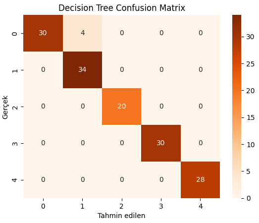
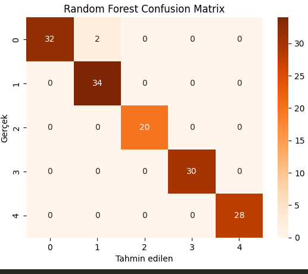
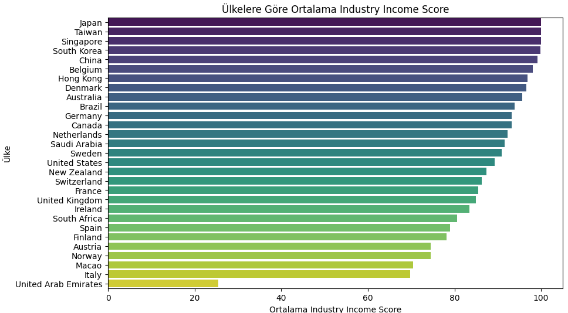

# Dünyadaki Üniversitelerin Veri Analizi 

Bu proje, üniversite performans veri seti üzerinde yapılan analizleri ve görselleştirmeleri içerir.  
Özellikle eğitim ve araştırma skorları arasındaki ilişki, sayısal metrikler arasındaki korelasyon ve ülke bazında Overall Score ortalamaları incelenmektedir.

---

## Proje Amacı

- Üniversite performans verilerini analiz ederek eğitim ve araştırma skorları arasındaki ilişkileri anlamak.  
- Sayısal değişkenler arasındaki korelasyonları belirlemek.  
- Ülkeler bazında ortalama performans farklılıklarını görselleştirmek.  

Proje, veri analizi ve görselleştirme adımlarını birleştirerek üniversite performansına dair içgörüler üretmeyi hedefler.

---

## Veri Seti
- Format: CSV  
- Özellikler:
  - Location → Üniversitenin bulunduğu ülke  
  - Teaching → Öğretim kalitesi skoru  
  - Research Score → Araştırma performans skoru  
  - Overall Score → Genel performans  
  - Diğer sayısal skorlar: Industry Income Score, International Outlook Score vb.

---

## Veri İşleme Adımları
1. Pandas, Numpy, Matplotlib gibi gerekli kütüphaneleri projeme dahil ettim.
2. data.csv dosyasını okuyup tablo haline getirdim.
3. Veri Yükleme: CSV dosyası okunmuş ve ilk birkaç satır görüntülenmiştir.  
4. Sütun Seçimi: Teaching ve Research Score sütunları seçilmiş ve sayısala dönüştürülmüştür.  
5. Eksik Veri Temizliği: Analiz için gerekli sütunlarda eksik veriler çıkarılmıştır.  
6. Korelasyon Analizi: Sayısal tüm sütunlar arasındaki Pearson korelasyon katsayıları hesaplanmış ve ısı haritası ile görselleştirilmiştir.  
7. Ülke Bazlı Ortalama: Overall Score değerleri ülke bazında gruplanmış ve ortalama skorlar çizgi grafiği ile görselleştirilmiştir.

---

## Görseller ve Yorumlar

### 1. Sayısal Değişkenler Arasındaki Korelasyon

 
+ Heatmap, sayısal skorlar arasındaki ilişkileri renk ve sayı ile gösteriyor.  
+ Teaching ve Research Score arasında güçlü bir pozitif korelasyon mevcut (r = 0.97).  
+ Research Quality ve Research Score arasında diğerlerine nazaran daha güçsüz bi bağlantı var (r = 0.79). Bu da Research Quality'nin Overall Score'de çok etkisinin olmadığını gösterir. 
+ Analiz, hangi skorların birbirini etkilediğini ve hangi metriklerin bağımsız hareket ettiğini ortaya koyar.

### 2. Lineer Regresyon: Research → Teaching

**Yorum:**  
+ R^2 = 0.9549 dur. Bu değer bize Lineer Regresyon başarısı -> %95.49'dur ve bu da gayet yüksek bir orandır.
+ Research Score arttıkça Teaching skoru da artıyor; pozitif doğrusal ilişki gözlemleniyor.  
+ Bu, yüksek araştırma performansına sahip üniversitelerin öğretim açısından da güçlü olabileceğini gösteriyor.  
+ Veri noktalarının dağılımı, uç değerler ve genel trend regresyon çizgisi ile anlaşılabiliyor.
+ Görselin sol altında yazan eğim (değişim hızı) bize her bir araştırma puan artışının ne kadar etkilediğini gösterir.

### 3. Ülkelere göre endüstri - outlook - overall score ilişkisi

Temel Metrikler:

X Ekseni: Ülkenin Endüstri Gelir Skoru (Endüstriyel güç/başarı).

Y Ekseni : Ülkenin Uluslararası Görünüm Skoru (Küresel erişim/çekicilik).

Renk Skalası: Ülkenin Overall Score değerini gösterir

Ana Çıkarımlar:

Yüksek Performanslı Liderler: Singapur, İsviçre ve Hong Kong gibi ülkeler hem Endüstri Gelirinde hem de Uluslararası Görünümde yüksek skorlara sahiptir.

Küresel Etki Alanı Yüksek Olanlar: Arab Emirlikleri ve Macao gibi ülkeler, Uluslararası Görünümde çok yüksek skorlar alarak küresel çekim güçlerini kanıtlar.

Düşük Genel Skor: Japonya, Güney Kore ve Brezilya, yüksek Endüstri Gelirine rağmen Uluslararası Görünüm ve Genel Skorlarda daha alt sıralarda yer almaktadır.
  
## Modellerin projeye uygunluk oranları 
KNN                  97,26%       
SVM                  95,89%       
Decision Tree        97,26%       
Random Forest        98,63%       
Logistic Regression  95,89%       
Naive Bayes          93,84%       

+Random Forest modeli %98.63 ile en yüksek doğruluk oranı var. 
Genel olarak tüm modeller iyi performans göstermiş olup Random Forest projenin en başarılı modelidir.

### Decision Tree - Random Forest 

-Bu Karmaşıklık Matrisi, Karar Ağacı modelinin 5 farklı sınıfı (0'dan 4'e) sınıflandırma performansını göstermektedir; ana köşegen üzerindeki yüksek sayılar (örneğin 34 ve 30) modelin çoğu sınıfı yüksek doğrulukla tahmin ettiğini belirtir. Modelin tek belirgin hatası, gerçek sınıfı 0 olan 4 örneği yanlışlıkla sınıf 1 olarak tahmin etmesidir, ki bu da modelin sınıfları birbirinden ayırmada genel olarak başarılı olduğunu gösterir.

Bu Karmaşıklık Matrisi, Rastgele Orman (Random Forest) modelinin 5 farklı sınıfı (0'dan 4'e) sınıflandırma performansını göstermekte olup, ana köşegen dışındaki tek hata Gerçek sınıfı 0 olan 2 örneğin yanlışlıkla sınıf 1 olarak tahmin edilmesidir. Model, özellikle Sınıf 1'i 34 kez doğru tahmin ederek, Karar Ağacı modeline kıyasla Sınıf 0'daki yanlış tahmin sayısını 4'ten 2'ye düşürerek daha yüksek bir genel doğruluk sergilemiştir.

### Endüstri Geliri İle Ülkeleri karşılaştırma grafiği

-Bu yatay çubuk grafik, seçili ülkelerin Ortalama Industry Income Score (Endüstri Gelir Skoru) değerlerini en yüksekten en düşüğe doğru sıralamaktadır. Bu skor, bir ülkenin endüstriyel ekonomik gücünü veya başarısını temsil eder.

-En Yüksek Skorlar: Japonya, Tayvan, Singapur ve Güney Kore, ortalama 100 puana yakın skorlarla listenin başında yer almaktadır.

-Yüksek Skor Alan Diğer Ülkeler: Çin, Belçika, Hong Kong ve Danimarka da 95 ile 100 arasında yüksek skorlara sahiptir.

-Orta Skorlu Ülkeler: Listenin ortalarında yer alan ülkeler (örneğin ABD, İsveç, Kanada) ortalama 85-90 civarında skorlara sahiptir.

-Daha Düşük Skorlu Ülkeler: Norveç, Avusturya, Finlandiya ve İspanya gibi Avrupa ülkeleri, 75 ile 85 arasında değişen skorlarla orta-düşük grupta yer almaktadır.

-En Düşük Skorlar: Listenin sonunda, yaklaşık 70 puanla İtalya, 65 puan civarında Macao ve en düşük skorla (yaklaşık 25 puan) Birleşik Arap Emirlikleri (United Arab Emirates) bulunmaktadır.

-Bu sıralama, bir ülkenin endüstriyel gelir veya ekonomik gücü açısından küresel rakiplerine göre nerede konumlandığını net bir şekilde göstermektedir.

## Sonuç

Bu proje kapsamında üniversitelerin performans verileri detaylı bir şekilde analiz edilmiştir. Analizler, eğitim ve araştırma skorları arasındaki güçlü ilişkiler, sayısal değişkenler arasındaki korelasyonlar ve ülkeler bazında genel performans farklılıklarını ortaya koymuştur. Farklı makine öğrenmesi modelleriyle yapılan sınıflandırma çalışmaları, Random Forest modelinin en yüksek doğruluk oranını gösterdiğini ortaya koymuştur. Elde edilen görselleştirmeler ve istatistiksel sonuçlar, üniversite performansını etkileyen temel faktörleri anlamaya ve küresel karşılaştırmalar yapmaya olanak sağlamaktadır.

